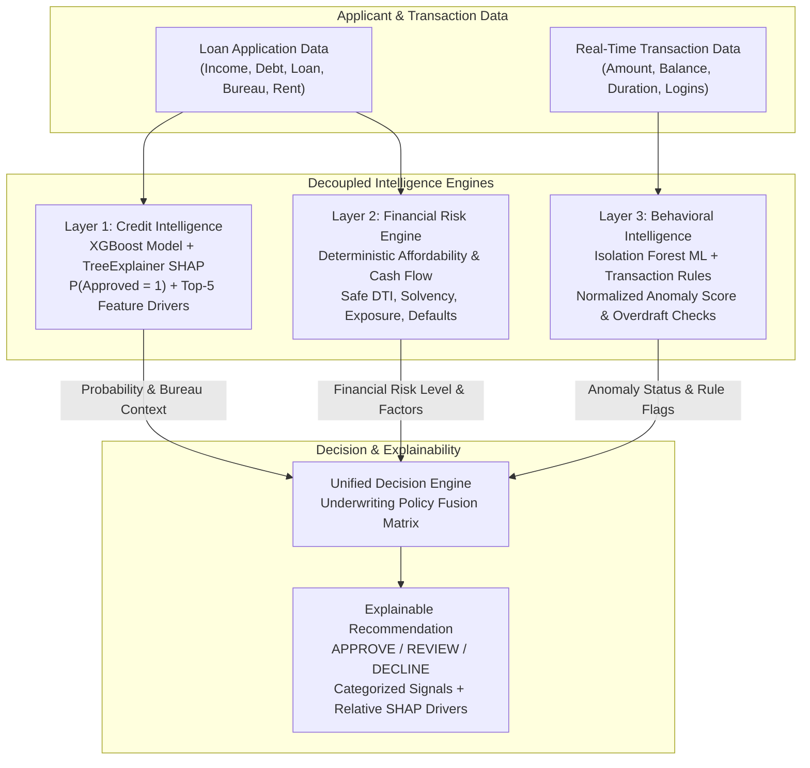

# CredMe — Real-Time Credit Intelligence Platform

CredMe is an AI-powered credit intelligence and responsible lending assessment platform built for the **"Next-Gen Credit Intelligence: Building a Real-Time, Multi-Modal Underwriting Engine"** problem statement. It fuses machine-learning credit risk modeling, deterministic financial capacity checks, and real-time behavioral anomaly detection to produce transparent, explainable **APPROVE / REVIEW / DECLINE** recommendations.

CredMe is specifically engineered with **thin-file / New-to-Credit (NTC)** inclusion principles, ensuring that applicants without traditional credit scores are evaluated fairly based on income, debt obligations, alternative data, and transaction behavior rather than being automatically penalized.

---

## 1. Core Architecture & Intelligence Layers

CredMe decomposes decisioning into **three logically independent intelligence layers** combined by a final **Decision Engine**:



### Layer 1: Credit Intelligence (ML & Explainability)
- **Model**: Pre-trained XGBoost Classifier (`models/credit_model.joblib`) producing the exact predicted probability of approval $P(\text{Approved} = 1)$.
- **SHAP Attribution**: Per-request `shap.TreeExplainer` computing the Top 5 model drivers with **Relative SHAP Contribution (%)** and explicit directional impact (*Increases approval likelihood* / *Decreases approval likelihood*).
- **Thin-File Baseline Representation**: `CreditScore = 0` is converted to `NaN` and median-imputed (~650) to provide a neutral baseline input representation for the model, while thin-file uncertainty is separately preserved and evaluated in policy context.

### Layer 2: Financial Risk Engine (Deterministic Affordability)
- **Debt-to-Income (DTI)**: Evaluates monthly debt obligations relative to monthly income with complete zero-division safety. Categorizes DTI $\ge 100\%$ as **Critical Affordability Risk** ($1.0\text{x}+$ income).
- **Cash Flow Solvency**: Computes net monthly cash flow (`Monthly Income - Monthly Debt`).
- **Loan Exposure**: Flags requested loan amounts exceeding $2\times$ annual income.
- **Alternative Bureau Data**: Evaluates `RentPaymentConsistency` ($0 - 100\%$) for thin-file applicants without altering scoring for traditional credit profiles.
- **Credit Bureau History**: Screens for prior defaults, bankruptcies, and high revolving utilization ($\ge 80\%$).

### Layer 3: Behavioral Intelligence (ML & Transaction Rules)
- **Behavioral Anomaly ML**: `IsolationForest` unsupervised model (`models/behavior_model.joblib`) scoring transaction velocity and amounts into a **Normalized Anomaly Score (0–100)** and classifying status as `NORMAL` or `ANOMALOUS`.
- **Deterministic Transaction Rules**: Evaluates account constraints independently from the ML model (e.g. flagging `Transaction Amount > Available Balance` as an account overdraft warning without mislabeling it as fraud).
- **Overall Behavioral Risk**: Outputs `LOW`, `MEDIUM`, or `HIGH` risk level.

---

## 2. Responsible Lending & Thin-File Decision Policy

CredMe enforces explicit, defensible underwriting policies:

1. **Thin-File Never Auto-Declines**: Lack of traditional credit history alone **never** causes a `DECLINE`.
2. **Thin-File Never Auto-Approves**: Lack of traditional credit history alone **never** guarantees an `APPROVE`. A thin-file applicant qualifies for `APPROVE` only when independent credit prediction ($P \ge 70\%$), financial health (`LOW` risk), and clean transaction behavior independently support approval.
3. **Uncertainty Routes to Review**: If signals are mixed, borderline, or feature elevated financial/transaction risk, the application is routed to **`REVIEW`** with clear, itemized evidence for human underwriters.
4. **Separation of Rule Flags from Fraud**: Account constraints (e.g., transaction exceeding balance) are transparently distinguished from ML anomaly classifications.

---

## 3. Endpoints & API Reference

CredMe provides a streamlined, secure REST API powered by FastAPI:

| Endpoint | Method | Role Required | Purpose |
|---|:---:|:---:|---|
| **`/health`** | `GET` | None | Liveness check and model load verification |
| **`/decision`** | `POST` | `applicant` | Unified multi-layer assessment fusing Credit Intelligence, Financial Risk Analysis, Behavioral Intelligence, and Explainable AI reasons |

### Authentication
Every decision request requires an `X-API-Key` header:
- Header: `X-API-Key: credme-dev-applicant-key` (configurable via `CREDME_API_KEY_APPLICANT` environment variable).

### Supporting Offline Modules
- **Fairness Audit (`backend/fairness_audit.py`)**: Offline disparate-impact audit script evaluating the credit model across Age and Marital Status using the four-fifths (80%) adverse impact rule.
- **Explainability Narrative Scaffold (`backend/llm_layer.py`)**: Plain-English narrative translation module with safety guardrails against protected characteristics.

---

## 4. Tech Stack

- **Frontend**: React 19 + Vite + Modern Glassmorphic Fintech UI
- **Backend**: FastAPI (Python 3.13), Pydantic v2 validation
- **Machine Learning**: XGBoost Classifier, Scikit-Learn IsolationForest, SHAP TreeExplainer
- **Data & Persistence**: Joblib serialized model pipelines (`models/`), tabular references (`data/`)
- **Testing & Quality**: Pytest test suite (20/20 tests passing), Oxlint + Vite build

---

## 5. Quickstart & Local Setup

### 1. Clone Repository

```bash
git clone https://github.com/ADlio1408/CredME.git
cd CredME
```

### 2. Backend Setup

```bash
python3 -m venv .venv
source .venv/bin/activate
pip install -r backend/requirements.txt
uvicorn backend.api:app --reload --port 4000
```

The API loads model artifacts from `models/` on startup and listens at `http://127.0.0.1:4000`.

### 3. Frontend Setup

```bash
cd frontend
npm install
npm run dev
```

The frontend runs at `http://localhost:5173` and communicates with `http://127.0.0.1:4000`.

### 4. Running Tests

```bash
source .venv/bin/activate
pytest backend/tests/ -v
```

---

## 6. Model Performance

- **Credit Model (XGBoost on `data/Loan.csv`, 20% held-out test split)**:
  - **ROC-AUC**: `0.9791`
  - **Accuracy**: `0.9307`
  - **Precision**: `0.8678`
  - **Recall**: `0.8379`
  - **F1 Score**: `0.8526`
  - **Brier Score**: `0.0486`

- **Behavioral Model (Isolation Forest on transaction streams)**:
  - Configured at `5%` contamination rate to detect out-of-distribution transaction velocities and amount deviations.
