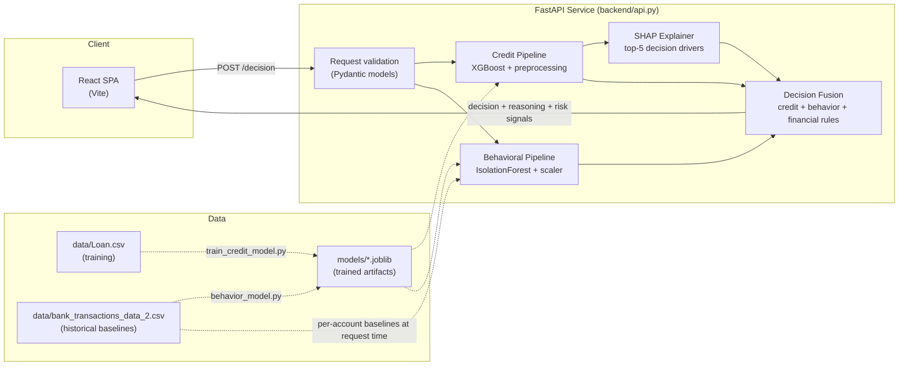

# CredMe — Real-Time Credit Intelligence Platform

CredMe is a credit decisioning prototype built for the **"Next-Gen Credit
Intelligence: Building a Real-Time, Multi-Modal Underwriting Engine"**
problem statement. It combines a traditional credit signal with real-time
behavioral/transaction signals to produce an explainable APPROVE / REVIEW /
DECLINE recommendation — with an explicit design goal of not penalizing
**New-to-Credit (NTC) / thin-file** applicants for having no credit score.

## The core idea

Most credit models treat a missing credit score as a bad one. CredMe treats
`CreditScore = 0` as **"no traditional credit history"**, not **"bad
credit"**:

- During training, `CreditScore = 0` is converted to a missing value and
  median-imputed, so the model never learns "0 → decline."
- During inference, a thin-file applicant is routed through a separate
  decision path that only escalates to `REVIEW` on genuine financial/
  behavioral risk — thin-file status alone can never cause a `DECLINE`.
  This is enforced in code and covered by tests
  (see `backend/tests/test_api.py::test_thin_file_never_auto_declines`).

That decision is then fused with a real-time behavioral risk read on the
applicant's transaction activity — anomaly detection, login attempts,
transaction-to-balance ratio — so a strong credit profile with suspicious
current activity is routed to review rather than auto-approved.

## Architecture



**Endpoints**

| Endpoint          | Auth required | Purpose                                                            |
|-------------------|:---:|---------------------------------------------------------------------|
| `GET /health`     | No | Liveness + model-load check                                        |
| `GET /fairness/report` | No | Pre-computed disparate-impact audit of the credit model      |
| `POST /predict`   | Yes | Credit-only assessment (approval probability, SHAP reasons)        |
| `POST /behavior/check` | Yes | Behavioral-only assessment (anomaly score, risk signals)      |
| `POST /decision`  | Yes | Unified decision — fuses credit + behavior + financial rule screen |

## Tech stack

- **Frontend:** React 19 + Vite
- **Backend:** FastAPI (Python), Pydantic for request validation
- **ML:** XGBoost (credit approval), scikit-learn IsolationForest (behavioral
  anomaly detection), SHAP (explainability)
- **Data:** CSV-based training/reference data (`data/`), trained artifacts
  persisted as `.joblib` (`models/`)
- **Containerization:** Docker + docker-compose (`backend/Dockerfile`,
  `frontend/Dockerfile`, `docker-compose.yml`)

## Model performance

Credit model (XGBoost, 20% held-out test split, `data/Loan.csv`):

| Metric    | Value  |
|-----------|--------|
| Accuracy  | 0.9307 |
| Precision | 0.8678 |
| Recall    | 0.8379 |
| F1        | 0.8526 |
| ROC-AUC   | 0.9791 |
| Brier     | 0.0486 |

Behavioral model (IsolationForest, `data/bank_transactions_data_2.csv`,
~2,512 transactions): flags ~5.02% of transactions as anomalous
(contamination is configured at 5%).

Re-run `python backend/train_credit_model.py` or
`python backend/behavior_model.py` to regenerate these numbers and the
saved model artifacts.

**Fairness audit:** `python backend/fairness_audit.py` screens the trained
credit model's approval decisions for disparate impact across Age and
Marital Status using the four-fifths rule, and writes
`models/fairness_report.json` (served live at `GET /fairness/report`). The
current run flags younger applicants (`<25`, `25-39`) for disparate impact
— but predicted approval rates track actual/historical approval rates
closely per group, indicating the model reflects a pattern already present
in the training data rather than amplifying it. See
[Known gaps / roadmap](#known-gaps--roadmap) for what that implies.

## Setup & run

### Backend

```bash
cd CredMe
python3 -m venv .venv
source .venv/bin/activate
pip install -r backend/requirements.txt
cp backend/.env.example backend/.env   # then edit CREDME_API_KEY
export CREDME_API_KEY=changeme          # or use a .env loader of your choice
uvicorn backend.api:app --reload --port 4000
```

The API loads model artifacts from `models/` and reference transaction data
from `data/` on startup — no database required for this prototype.

`POST /predict`, `POST /behavior/check`, and `POST /decision` require an
`X-API-Key` header matching `CREDME_API_KEY`. If the env var isn't set, the
API falls back to a published development key (`credme-dev-local-key`) so
the prototype still runs out of the box locally — **set a real key before
any shared or public deployment.**

### Frontend

```bash
cd frontend
cp .env.example .env.local   # optional locally — must match backend's key if set
npm install
npm run dev
```

The frontend expects the API at `http://127.0.0.1:4000` (see
`frontend/src/App.jsx`) and sends `VITE_API_KEY` as the `X-API-Key` header,
defaulting to the same development fallback key as the backend.

### Docker (both services)

```bash
docker compose up --build
```

- Backend: `http://localhost:4000`
- Frontend: `http://localhost:5173`

Set `CREDME_API_KEY` in your shell (or a root-level `.env` file) before
running to use a real key instead of the development fallback:

```bash
CREDME_API_KEY=your-real-key docker compose up --build
```

Note: the frontend's API key is baked in at build time (Vite env vars are
compile-time), so changing `CREDME_API_KEY` requires rebuilding the
frontend image, not just restarting the container.

Verified: `docker compose build` + `docker compose up` — both containers
start cleanly and `/health`, `/fairness/report`, an authenticated
`/decision` call, and the nginx-served frontend all respond correctly.

### Tests

```bash
source .venv/bin/activate
pip install pytest httpx
python -m pytest backend/tests/ -v
```

## Responsible AI / explainability

- Every `/predict` and `/decision` response includes the top-5 SHAP feature
  attributions behind the credit score, translated into readable
  reasons + direction of effect.
- `/decision` returns a plain-language `reasoning` string plus itemized
  `high_risk_signals`, `medium_risk_signals`, and `financial_concerns` so a
  human reviewer can see exactly what drove the recommendation.
- Thin-file status is surfaced explicitly (`thin_file: true`) rather than
  silently folded into the credit score, so reviewers know when a decision
  was made without traditional credit history.
- The system returns a **recommendation**, not an autonomous decision —
  `REVIEW` is the deliberate default whenever signals are mixed.
- **Fairness audit:** `GET /fairness/report` exposes a four-fifths-rule
  disparate-impact screen of the credit model across Age and Marital Status
  (see `backend/fairness_audit.py`). This is a real, run-against-the-shipped-
  model audit, not a placeholder — it currently flags applicants under 25
  and 25-39 for disparate impact, while showing the model's predicted
  approval rates closely track actual historical approval rates per group.
  That distinction matters: it points to a **training-data representativeness
  issue**, not the model independently inventing new bias — the honest fix is
  collecting more/better data for younger applicants, not just tweaking the
  model.
- **API authentication:** `/predict`, `/behavior/check`, and `/decision`
  require an `X-API-Key` header; the key is read from an environment
  variable, never hardcoded (see [Setup & run](#setup--run)).

## Known gaps / roadmap

This is a hackathon prototype, not a production system. Explicitly out of
scope for this submission:

- **Persistence:** no database — application/decision history is not
  stored. A production version would persist to PostgreSQL and add an
  audit trail for every decision.
- **True real-time behavioral data:** account baselines are computed from a
  static CSV at startup rather than a live transaction stream.
- **Additional alternative-data modalities:** only loan-application data and
  bank transactions are used today; utility/rent payment history, telecom
  data, etc. would strengthen the NTC use case further.
- **Cloud deployment:** the app is containerized (Docker + docker-compose)
  but not deployed anywhere — no AWS/cloud hosting, no monitoring/logging
  infrastructure.
- **Authorization beyond a shared API key:** current auth proves the caller
  holds a valid key; it does not implement per-user identity, roles, or
  scopes (no login system fronts this prototype).
- **LLM layer:** no generative model is used; explainability is handled
  entirely via SHAP + rule-based reasoning, which is deterministic and
  auditable but doesn't produce free-text narrative explanations.
- **Fairness remediation:** the audit identifies disparate impact by age;
  it does not yet implement a remediation (e.g. reweighing, threshold
  adjustment per group, or targeted data collection) — that's the natural
  next step once the flag is confirmed against a larger/real dataset.
