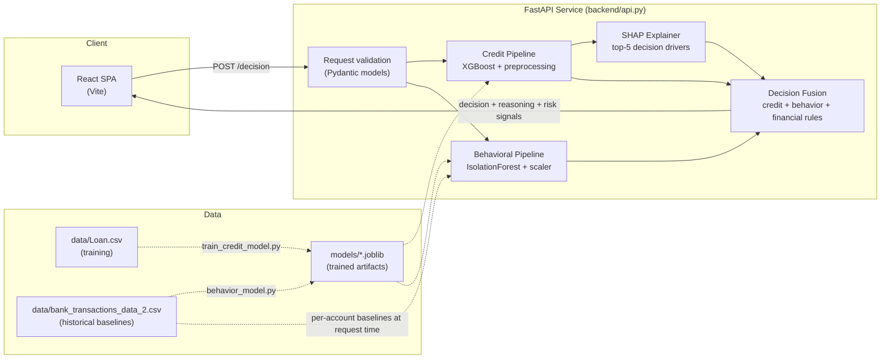

# CredMe — Real-Time Credit Intelligence Platform

CredMe is a credit decisioning prototype built for the **"Next-Gen Credit
Intelligence: Building a Real-Time, Multi-Modal Underwriting Engine"**
problem statement. It combines a traditional credit signal with real-time
behavioral/transaction signals to produce an explainable APPROVE / REVIEW /
DECLINE recommendation — with an explicit design goal of not penalizing
**New-to-Credit (NTC) / thin-file** applicants for having no credit score.

## The core idea

Most credit models treat a missing credit score as a bad one. CredMe treats
`CreditScore = 0` as **"no traditional credit history"**, not **"bad
credit"**:

- During training, `CreditScore = 0` is converted to a missing value and
  median-imputed, so the model never learns "0 → decline."
- During inference, a thin-file applicant is routed through a separate
  decision path that only escalates to `REVIEW` on genuine financial/
  behavioral risk — thin-file status alone can never cause a `DECLINE`.
  This is enforced in code and covered by tests
  (see `backend/tests/test_api.py::test_thin_file_never_auto_declines`).

That decision is then fused with a real-time behavioral risk read on the
applicant's transaction activity — anomaly detection, login attempts,
transaction-to-balance ratio — so a strong credit profile with suspicious
current activity is routed to review rather than auto-approved.

For thin-file applicants specifically — the population traditional credit
data structurally can't speak to — CredMe also accepts an optional
alternative-data signal, `RentPaymentConsistency`, illustrating how a real
alternative-data source would plug into the thin-file path without
touching the traditional-credit population at all (it's ignored entirely
for applicants who have a credit score).

## Architecture



**Endpoints**

| Endpoint          | Role required | Purpose                                                            |
|-------------------|:---:|---------------------------------------------------------------------|
| `GET /health`     | none | Liveness + model-load check                                        |
| `GET /fairness/report` | none | Pre-computed disparate-impact audit of the credit model      |
| `POST /predict`   | applicant | Credit-only assessment (approval probability, SHAP reasons)        |
| `POST /behavior/check` | applicant | Behavioral-only assessment (anomaly score, risk signals)      |
| `POST /decision`  | applicant | Unified decision — fuses credit + behavior + financial rule screen |
| `POST /stream/transaction` | admin | Ingests one live transaction, scores it, updates that account's baseline in place, broadcasts it |
| `WS /stream/live?api_key=...` | applicant or admin | Live feed of every ingested streamed transaction |
| `POST /explain/narrative` | admin | Runs `/decision`, then rephrases the result into a short applicant-facing narrative |

The WebSocket takes its key as a query param (`?api_key=...`) since
browser `WebSocket` clients can't set custom headers at handshake time; any
valid applicant or admin key may connect to watch the feed, but only an
admin key can write to it via `/stream/transaction`.

## Tech stack

- **Frontend:** React 19 + Vite
- **Backend:** FastAPI (Python), Pydantic for request validation
- **ML:** XGBoost (credit approval), scikit-learn IsolationForest (behavioral
  anomaly detection), SHAP (explainability)
- **Data:** CSV-based training/reference data (`data/`), trained artifacts
  persisted as `.joblib` (`models/`)
- **Containerization:** Docker + docker-compose (`backend/Dockerfile`,
  `frontend/Dockerfile`, `docker-compose.yml`)
- **LLM layer (scaffold):** OpenAI SDK integration for applicant-facing
  narrative generation (`backend/llm_layer.py`) — wired, guardrailed, and
  disabled by default (see below)

## AI layer: narrative explanations (LLM scaffold)

`POST /explain/narrative` runs the same deterministic `/decision` pipeline
and then asks an LLM to rephrase the already-made decision into a short,
plain-English explanation for the applicant. The LLM never makes or
influences the decision — it only rephrases a result that SHAP + rule-based
logic already produced.

- **Prompt template:** constrained to the decision's own fields only (see
  `PROMPT_TEMPLATE` in `backend/llm_layer.py`); the model is explicitly
  instructed not to invent reasons, not to reference protected
  characteristics, and not to imply the decision could change on request.
- **Guardrails:** output is scanned for protected-characteristic language
  (race, gender, religion, disability, etc.) before being returned; a
  violation swaps in a safe, generic fallback narrative instead of the
  generated text, and the violation is reported in the response
  (`guardrail_violations`) rather than silently hidden.
- **No live calls by default:** `CREDME_LLM_API_KEY` is unset in this
  environment on purpose. Without it, the endpoint returns a deterministic,
  template-based narrative built from the same fields the prompt would use
  (`"source": "template_fallback"`) — the integration code is real and
  tested, but nothing is sent to a model or billed unless a key is
  explicitly configured. Set `CREDME_LLM_API_KEY` to an OpenAI API key from
  `platform.openai.com` (a ChatGPT Plus/Go/Pro subscription does **not**
  include API access — API billing is separate) and optionally
  `CREDME_LLM_MODEL` (default `gpt-4o-mini`) to enable real calls.

## Model performance

Credit model (XGBoost, 20% held-out test split, `data/Loan.csv`):

| Metric    | Value  |
|-----------|--------|
| Accuracy  | 0.9307 |
| Precision | 0.8678 |
| Recall    | 0.8379 |
| F1        | 0.8526 |
| ROC-AUC   | 0.9791 |
| Brier     | 0.0486 |

Behavioral model (IsolationForest, `data/bank_transactions_data_2.csv`,
~2,512 transactions): flags ~5.02% of transactions as anomalous
(contamination is configured at 5%).

Re-run `python backend/train_credit_model.py` or
`python backend/behavior_model.py` to regenerate these numbers and the
saved model artifacts.

**Fairness audit:** `python backend/fairness_audit.py` screens the trained
credit model's approval decisions for disparate impact across Age and
Marital Status using the four-fifths rule, and writes
`models/fairness_report.json` (served live at `GET /fairness/report`). The
current run flags younger applicants (`<25`, `25-39`) for disparate impact
— but predicted approval rates track actual/historical approval rates
closely per group, indicating the model reflects a pattern already present
in the training data rather than amplifying it. See
[Known gaps / roadmap](#known-gaps--roadmap) for what that implies.

## Setup & run

### 1. Clone Repository

```bash
git clone https://github.com/ADlio1408/CredME.git
cd CredME
```

### 2. Backend

```bash
python3 -m venv .venv
source .venv/bin/activate
pip install -r backend/requirements.txt
uvicorn backend.api:app --reload --port 4000
```

The API loads model artifacts from `models/` and reference transaction data
from `data/` on startup — no database required for the core decisioning
endpoints (the optional semantic-search feature does use one — see
[Semantic case search](#semantic-case-search-pgvector)).

Every business endpoint requires an `X-API-Key` header, checked against one
of two role-scoped keys:

| Role | Env var | Can call |
|---|---|---|
| `applicant` | `CREDME_API_KEY_APPLICANT` | `/predict`, `/behavior/check`, `/decision` |
| `admin` | `CREDME_API_KEY_ADMIN` | everything above, plus `/stream/transaction` and `/explain/narrative` |

If either env var is unset, the API falls back to a published development
key (`credme-dev-applicant-key` / `credme-dev-admin-key`) so the prototype
still runs out of the box locally — **set real keys before any shared or
public deployment.** A request with an applicant key to an admin-only
endpoint gets `403`, not `401` — the key is valid, it just lacks the scope.

### Frontend

```bash
cd frontend
cp .env.example .env.local   # optional locally — must match backend's key if set
npm install
npm run dev
```

The frontend expects the API at `http://127.0.0.1:4000` (see
`frontend/src/App.jsx`) and sends `VITE_API_KEY` as the `X-API-Key` header,
defaulting to the same development fallback key as the backend.

### Docker (both services)

```bash
docker compose up --build
```

- Backend: `http://localhost:4000`
- Frontend: `http://localhost:5173`

Set `CREDME_API_KEY_APPLICANT` / `CREDME_API_KEY_ADMIN` in your shell (or a
root-level `.env` file) before running to use real keys instead of the
development fallbacks:

```bash
CREDME_API_KEY_APPLICANT=your-real-key CREDME_API_KEY_ADMIN=your-other-real-key \
  docker compose up --build
```

Note: the frontend's API key is baked in at build time (Vite env vars are
compile-time), so changing `CREDME_API_KEY_APPLICANT` requires rebuilding
the frontend image, not just restarting the container.

Verified: `docker compose build` + `docker compose up` — both containers
start cleanly and `/health`, `/fairness/report`, an authenticated
`/decision` call, and the nginx-served frontend all respond correctly.

### Tests

```bash
source .venv/bin/activate
pip install pytest httpx
python -m pytest backend/tests/ -v
```

## Responsible AI / explainability

- Every `/predict` and `/decision` response includes the top-5 SHAP feature
  attributions behind the credit score, translated into readable
  reasons + direction of effect.
- `/decision` returns a plain-language `reasoning` string plus itemized
  `high_risk_signals`, `medium_risk_signals`, and `financial_concerns` so a
  human reviewer can see exactly what drove the recommendation.
- Thin-file status is surfaced explicitly (`thin_file: true`) rather than
  silently folded into the credit score, so reviewers know when a decision
  was made without traditional credit history.
- The system returns a **recommendation**, not an autonomous decision —
  `REVIEW` is the deliberate default whenever signals are mixed.
- **Fairness audit:** `GET /fairness/report` exposes a four-fifths-rule
  disparate-impact screen of the credit model across Age and Marital Status
  (see `backend/fairness_audit.py`). This is a real, run-against-the-shipped-
  model audit, not a placeholder — it currently flags applicants under 25
  and 25-39 for disparate impact, while showing the model's predicted
  approval rates closely track actual historical approval rates per group.
  That distinction matters: it points to a **training-data representativeness
  issue**, not the model independently inventing new bias — the honest fix is
  collecting more/better data for younger applicants, not just tweaking the
  model.
- **API authentication & authorization:** every business endpoint requires
  an `X-API-Key` header, checked against one of two role-scoped keys
  (`applicant` / `admin`) — not a single shared secret. Keys are read from
  environment variables, never hardcoded (see [Setup & run](#setup--run)).
- **Real-time behavioral streaming:** `POST /stream/transaction` scores a
  new transaction against the account's *current* baseline, then updates
  that baseline exactly (recomputed from the account's full historical +
  streamed amounts, not an approximation) so the next event for the same
  account reflects it. Every ingested event is pushed live to
  `WS /stream/live` subscribers. This is what makes "real-time" a genuine
  property of the system rather than a static CSV snapshot recomputed once
  at process startup.

